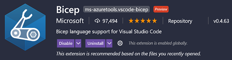
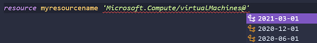

# EP7 - Getting Started with Azure Bicep

In this episode, I will show you how to get started with Azure Bicep. We'll walk through how to setup your environment, how to write Bicep code and of course how to deploy your code.

Watch the Full Episode on YouTube: https://youtu.be/R4KFPEj8f8c

Listen to the Audio Only version:
Google Podcasts: https://cutt.ly/ogvwqTl   
Apple Podcasts: https://cutt.ly/YgvweNk
Spotify Podcasts: https://cutt.ly/igvwezs
Stitcher Radio: https://cutt.ly/ugvwewo
Tunein Radio: https://cutt.ly/Xgvwwpf

Read the Episode blog here: https://www.someoneelsescloud.com/episodes/ep7-getting-started-with-azure-bicep

Social Media: http://instagram.com/someoneelsescloud 
Twitter: https://twitter.com/some1elsescloud

## What is Azure Bicep?
Bicep is a Domain-Specific Language (DSL) that uses declarative syntax to deploy Azure resources.

It acts as is a transparent abstraction layer over Azure Resource Manager (ARM) Templates. It reduces the complexity and improves the overall authoring experience over hand crafted ARM templates.

In short, you can use Bicep to build ARM templates without having to decrypt the JSON language.

This is definitely a step in the right direction by Microsoft, as Infrastructure as Code (IaC) is being widely adopted and CI/CD orchestration is here to stay.


Bicep files are identified by a **.bicep** extension. You can see that VSCode will recognise the file with the Bicep icon.


The VSCode extension has an excellent IntelliSense language service. This definitely helps with code completion, parameter info, quick info when building out Bicep code.

## Prerequities
- Azure Subscription

## Prepare your Environment
1. Install PowerShell
    - You can install [PowerShell](https://docs.microsoft.com/en-us/powershell/scripting/install/installing-powershell?view=powershell-7.1) from the Microsoft website.

2. Install Azure CLI
    - [Install Azure CLI](https://docs.microsoft.com/en-us/cli/azure/install-azure-cli) (will be required for deployment)

3. You can either install Azure Bicep using the Azure CLI or Installed (or Package Manager):
    - [Install Azure Bicep via Azure CLI](https://github.com/Azure/bicep/blob/main/docs/installing.md#install-and-manage-via-azure-cli-easiest)
    - [Standalone Installer for Azure Bicep](https://github.com/Azure/bicep/blob/main/docs/installing.md#install-and-manage-via-azure-powershell)

> **Note:** Installing either methods above will give you the same result. Just to note, when using Azure Bicep, the Azure CLI command does have additional options such as "upgrade".

4. Install Visual Studio Code Extension

    - Search for the following extension called Bicep.

    

## Creating your First Bicep File
1. Create a file named **main.bicep**.
2. The easiest way to create a code block for a resource is to use the IntelliSense language service, you can do this by completing the following:

### Option 1: (The not so simple way)
1. Declare a ***resource*** followed by an identifier i.e *myresourcename* (which can be used in expressions to reference the resource)
1. Type ***resource myresourcename virtualmachine*** (IntelliSense will auto complete the rest)
    
    

1. Once you find the resource type, you will need to select the API version.
    
    

1. Next by typing a ***'='*** sign and then ***space*** it will auto complete.
   
1. Select the ***required-properties*** from the auto completion menu.
    
    

1. Your virtual machine resource block should look like this.
    
    

So you might be wondering, is that all I need to deploy a virtual machine? According to Microsoft they are the required values you need to deploy!?

OK... So there is another way to get a base template for building resources, and its not by referencing the [ARM Templates page](https://docs.microsoft.com/en-us/azure/templates/)

### Option 2: (The simpler  way!)
1. Type ***res-vm*** and Intellisense will do the magic!

1. You will see that auto complete will show virtual machine types you can select!

    

1. Select ***res-vm-windows*** and magic!

       

> **Note:** *The base code may not be the latest  API version. If you wanted to use the latest API version, keep in mind that the parameters may have changed and review the following pages to ensure that your code will actually deploy!*

1. Update all the parameters you require for your virtual machine.
   
1. You can also reference the [ARM Templates page](https://docs.microsoft.com/en-us/azure/templates/) as there are references for both JSON and Bicep now.

    

1. You can find an explanation on properties values on the above page (scroll down the page):

    

> **For more information on the Bicep file format see [Understand the structure and syntax of Bicep files](https://docs.microsoft.com/en-us/azure/azure-resource-manager/bicep/file)**

## Use Bicep Build to Create ARM Templates (optional)
Ok once you have created all your Bicep files for all the resources you want to deploy, you will need to build ARM Templates from the Bicep files.

1. Run either of the following commands:
    ```
    bicep build .\main.bicep

    or

    az bicep build --file .\main.bicep
    ```
1. A new ARM Template file will be created named ***main.json***.

    

1. Now you have standard ARM Template file in JSON format.


## Deploy your Resources using Azure CLI

1. Connect to Azure by running ***az login***

1. Create a new Resource Group with the following command:

    ```
    az group create --name exampleRG --location eastus
    ```

1. Next deploy your ***bicep*** file or ***ARM Template*** with the following command:

    ```
    az deployment group create --resource-group exampleRG --template-file main.bicep --parameters storageName={your-unique-name}
    ```

## Helpful tips with Bicep
- Use Parameters and Variables where possible. This will allow for your Bicep code to be more dynamic and scalable. See the Project Bicep documentation from Microsoft on [Specifications](https://github.com/Azure/bicep/tree/main/docs/spec).
- Name resources so they are easily identifiable when using expressions. My code examples all end with "_resource" and are in lower case. This helps when you need to reference resources over actual names (if the values are not the same).
- Use the decompile function to covert JSON to Bicep, so you can get familiar with Bicep code and how it transfer to JSON.

## Code Overview
Diagram from the Bicep Visualiser, which is installed as part of the VSCode Bicep Extension  (located on the top right when a Bicep file is open)

### How to Deploy Episode Code
To build the code from the Episode run the following command:

    # Login to Azure
    az login

    # Create a localadmin password for your Windows virtual machine
    $adminPassword = ConvertTo-SecureString "mysecretpassword" -AsPlainText -Force

    # ObjectId is a mandatory field for the KeyVault Creation
    $userObjectId = az ad signed-in-user show --query objectId 
    
    # Set the uniqueName for all asset names
    $uniqueName = "bicep"

    # Create the Resource Group
    az group create --name "$uniqueName-rg-1" --location eastus

    # Build ARM Template from the Bicep file (optional - if used replace the following with main.json)
    az bicep build --file .\main.bicep

    # Deploy the Bicep file (replace main.bicep with main.json if the above is run - either will work)
    az deployment group create --resource-group "$uniqueName-rg-1" --name "$uniqueName-deployment" --template-file main.bicep --parameters uniqueName=$uniqueName adminPassword=$adminPassword userObjectId=$userObjectId 
    
    # Delete the Demo deployment
    az deployment group delete --resource-group "$uniqueName-rg-1" --name "$uniqueName-deployment"


### Resources Deployed
- Virtual Network
- Subnet
- Network Security Group
- Virtual Machine
- Network Interface
- Public IP Address
- Log Analytics Workspace
- InsightMetrics Solution
- Performance and Event Log Data Sources
- KeyVault
- KeyVault Secret (localadmin)

## Episode References
- [Project Bicep (Github)](https://github.com/Azure/bicep)
- [Bicep Configuration Examples](https://github.com/Azure/bicep/tree/main/docs/examples)
- [What is Bicep? The ARM Template DSL](https://techcommunity.microsoft.com/t5/apps-on-azure/what-is-bicep-the-arm-template-dsl/ba-p/1634067)
- [Azure Bicep March 2021: Learn everything about the next generation of ARM Templates (YouTube)](https://www.youtube.com/watch?v=l85qv_1N2_A)
- [Quickstart: Create Bicep files with Visual Studio Code](https://docs.microsoft.com/en-us/azure/azure-resource-manager/bicep/quickstart-create-bicep-use-visual-studio-code?tabs=CLI)
- [Bicep Playground](https://bicepdemo.z22.web.core.windows.net/)
- [Visual Studio Marketplace - Bicep Extension](https://marketplace.visualstudio.com/items?itemName=ms-azuretools.vscode-bicep)
